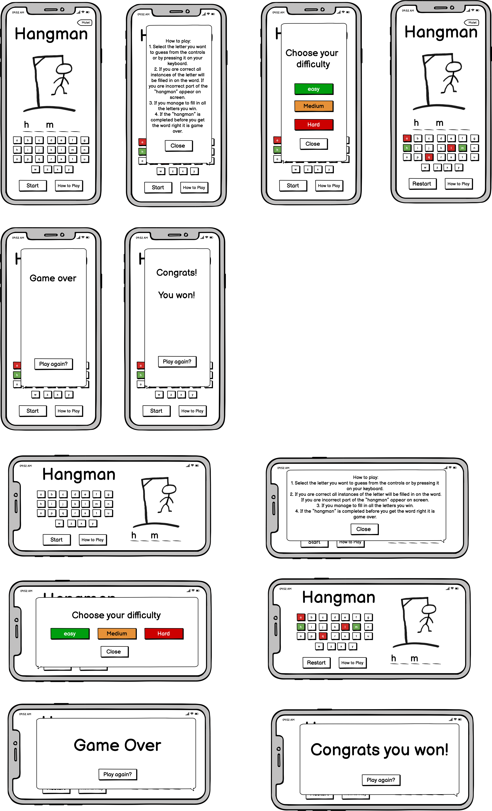
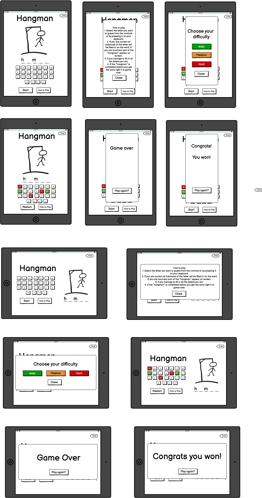
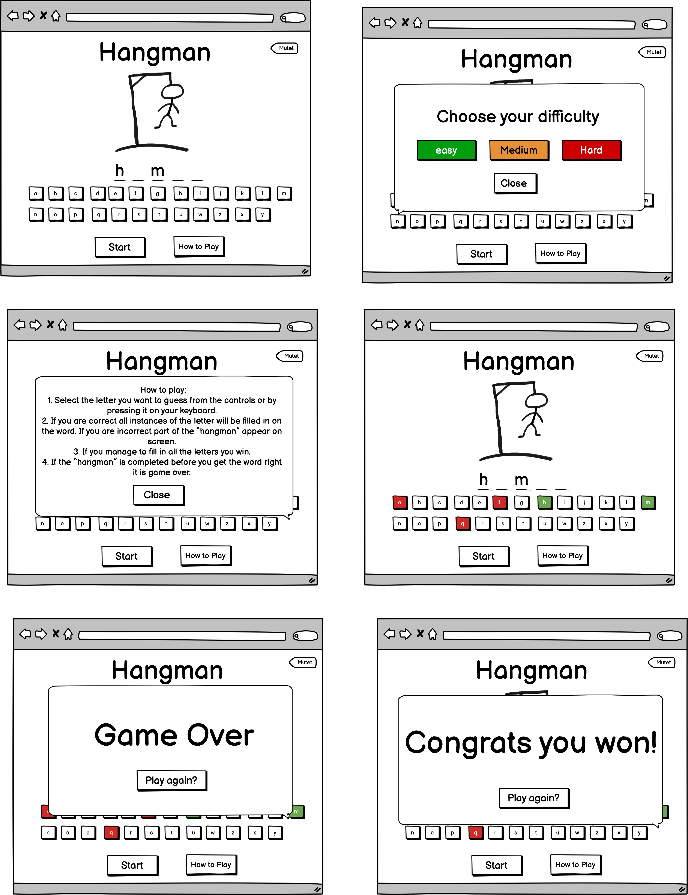

# **Hangman Game**

A web-based version of the children’s game Hangman. 

This project is my second milestone project for the Code Institute Diploma in Full Stack Software Development.

## **Contents**
* [UX](#ux)
    * [User Stories](#user-stories)
    * [Design](#design)
    * [Wireframes](#wireframes)

## **UX**

### **User stories**

#### As a user, I expect:
* To be able to easily see which letters have already been selected. 
* To be able to see how long the word I am guessing is and to clearly see which letters I have got right.  
* To be able to see how to play the game before I start 
* To be able to restart the game after I win or lose. 

#### As a user, I want:
* To be able to choose the difficulty setting for the game.
* To have audio and visual feedback based on my inputs.
* To be able to disable the games audio. 

### **Design**
For this project I took a mobile first approach to the design. To keep the interface as simple as possible. To this end I want the game to run on a single page with popups allowing the user to look at the how to play section or start a new game without having to navigate away from their game. 

To reflect the “school game” origin of the hangman game I wanted to use a hand drawn style. To achieve this, I used Adobe font Permanent Marker for all text elements in the game. 

The games colour palate was generated through Coolors.co. The colours were chosen to give visable feedback to the user allowing them to see at a glance if their guesses were incorrect or correct. 
 

### **Wireframes**

Before starting on the project, I created a mock up using balsamiq. 

#### **Mobile**

#### **tablet**

#### **Desktop**

