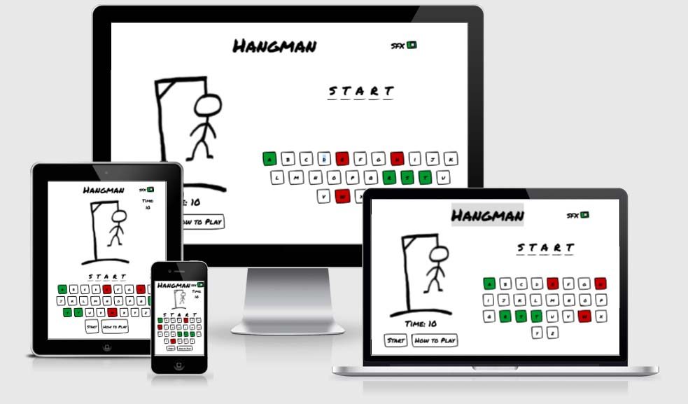
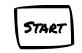
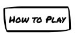
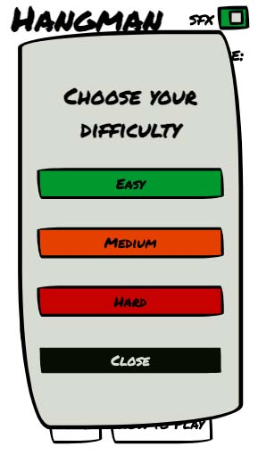
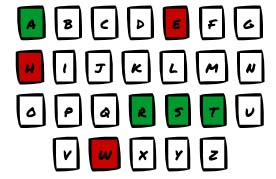
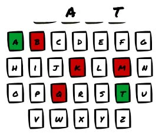
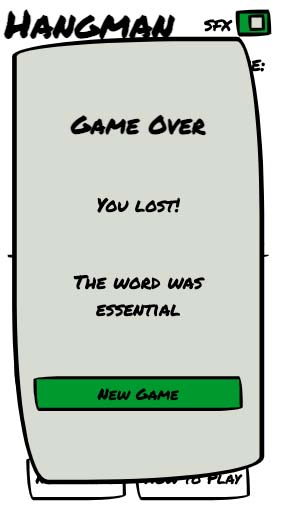
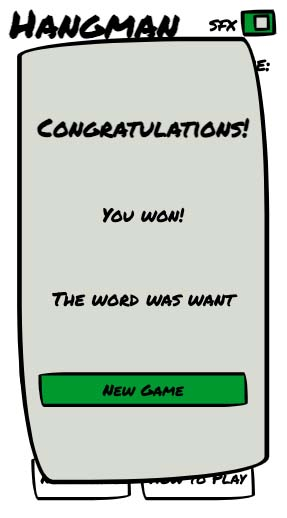
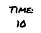

# **Hangman Game**

A web-based version of the children’s game Hangman. 

This project is my second milestone project for the Code Institute Diploma in Full Stack Software Development.

You can see the final deployed site [here](https://john-mcpherson.github.io/JavaScript-Essentials-Portfolio-Project/)

## **Contents**
* [UX](#ux)
    * [User Stories](#user-stories)
    * [Design](#design)
    * [Wireframes](#wireframes)
* [Features](#features) 
    * [Start Button](#start-button)
    * [Difficulty Select Pop Up](#difficulty-select-pop-up)
    * [How to Play Button**](#how-to-play-button)
    * [Difficulty Select Pop Up ](#difficulty-select-pop-up )
    * [On Screen Controls](#on-screen-controls)
    * [Keyboard Controls](#keyboard-controls)
* [Technologies Used](technologies-used)
* [Testing](#testing)
* [Deployment](#deployment)
* [Credits](#credits)
    * [Content](#content)
    * [Media](#media)
    * [Acknowledgements](#acknowledgements)

## **UX**

### **User stories**

#### As a user, I expect:
* To be able to easily see which letters have already been selected. 
* To be able to see how long the word I am guessing is and to clearly see which letters I have got right.  
* To be able to see how to play the game before I start 
* To be able to restart the game after I win or lose. 

#### As a user, I want:
* To be able to choose the difficulty setting for the game.
* To have audio and visual feedback based on my inputs.
* To be able to disable the games audio. 

### **Design**
For this project I took a mobile first approach to the design. To keep the interface as simple as possible. To this end I want the game to run on a single page with popups allowing the user to look at the how to play section or start a new game without having to navigate away from their game. 

To reflect the “school game” origin of the hangman game I wanted to use a hand drawn style. To achieve this, I used Adobe font Permanent Marker for all text elements in the game. 

The games colour palate was generated through Coolors.co. The colours were chosen to give visable feedback to the user allowing them to see at a glance if their guesses were incorrect or correct. 
 

### **Wireframes**

Before starting on the project, I created a mock up using balsamiq. 

#### **Mobile**

#### **Tablet**

#### **Desktop**

## **Features**

### **Start Button**
 * A button that allows the user to start the game. This should generate a word to be guessed and clear all wrong guesses.

### **How to Play Button**
 * A button that allows players to see how to play the game without navigating away from the game.  

 
### **Difficulty Select Pop Up**

### **Difficulty Select Pop Up**
 * Once the player clicks either the start game button or play again they should be given the option to select the difficulty. This will change which words will be guessed.  

  

### **On Screen Controls**
 * The user should  be able to control the game via clickable buttons. When the user selects them the buttons will change colour – red if the guess is wrong and green if the guess is correct providing the player with visual feedback. 
 
  
### **Keyboard Controls**
 * As well as being able to control the game via clickable buttons the user will also be able to select letters via their keyboard.  The buttons on the screen will also change colour to reflect if the player’s guess was correct or incorrect. 

### **Visual Feedback**
 * As the player makes incorrect guesses the hangman figure will be filled in allowing players to see exactly how far they are away from getting a game over. 
* There is a section on the game where players can see how many letters there are to guess;. As the player makes their guesses any correct guesses will fill in the blank spaces giving the player constant feedback as to how the game is going.

  

### **Audio Feedback**
 * The user should  get feedback in the form of sounds based on if their guess was correct or not. 
* The player will have the option to disable the sfxs if required. 

### **Game over/ congrats pop up**
 * When the game is either won or lost the game will display a popup either congratulating or commiserating the player. This will be accompanied by a button prompting the player to start a new game. 

      

### **New Game button**
 * The game will be accompanied by a button that allows the player to start a new game prior to finishing their current one.   

      
 ### **Timer**
 * To increase the players engagement and to prevent the game from being played indefintely I have included a 10 second timer. Once the timer hits 0 the player loses a life and the game state updates. 

   

### **Languages** 

* HTML5
* CSS3
* JavaScript

## **Testing**

[Link to External testing document](./TESTING.md)

## **Deployment**

The site is deployed via github pages. To deploy the site:

1. Go to the Github repository for the project.
2. Click on the settings menu at the top right-hand side of the page. 
3. Scroll down and select the pages tab towards the bottom of the menu. 
4. Select the source branch that you want to publish. 
5. Click save. This will generate a url for the site.  

## **Credits**

### **Content**

All code was written by me with the following exceptions; 
* The code for opening and closing the modals was adapted from [w3schools How TO - Toggle Switch](https://www.w3schools.com/howto/howto_css_switch.asp)
* The CSS to get the hand drawn effect on the buttons was taken from R3HAB Media’s [Hand-drawn Button Effect with CSS](https://www.youtube.com/watch?v=oJK7Y9cCPSQ) YouTube tutorial. 

### **Acknowledgements** 

* My mentor [Antonija Simic](https://github.com/tonkec) for their feedback and support during the development of the project. 
* [Code Institute](https://codeinstitute.net/) for giving me the skills through their tutorials to create this site. 
* [Free Code Camp](https://www.freecodecamp.org/) for introducing me to coding. 
* [JavaScript30]( https://javascript30.com/) for providing additional challenges to help me develop my JavaScript tools. 
* [Css-tricks.com](https://css-tricks.com/) and [W3Schools](https://www.w3schools.com/) for helping me whenever I got stuck. 

