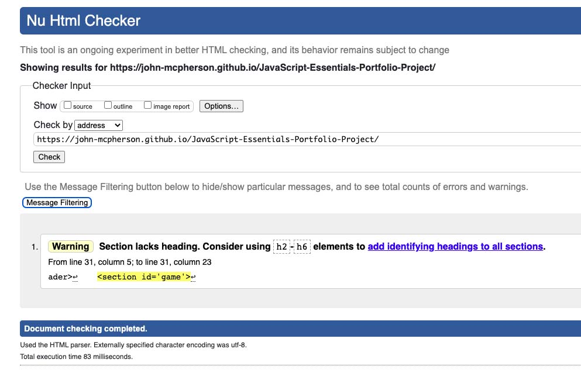
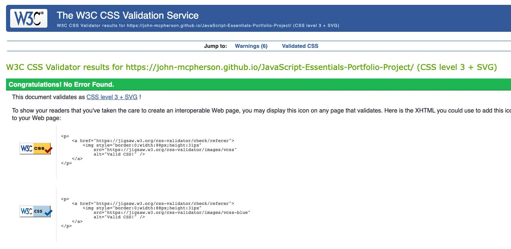
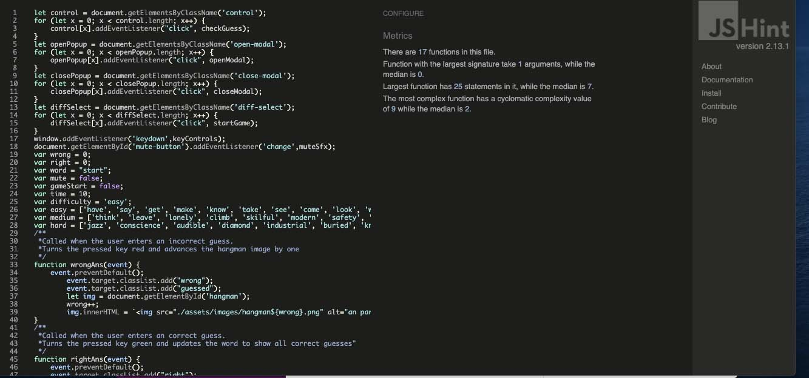
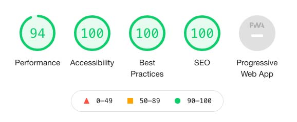
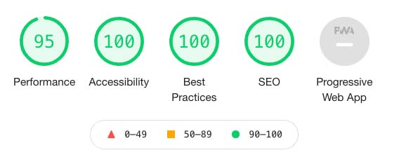

# **Testing** 

* [Functionality Testing](#functionality-testing)
* [Code Validation](#code-validation)
* [Performance](#performance)
* [Bug Fixes](#bug-fixes)
* [User Story Evaluations](#user-story-evaluations)

## **Functionality Testing**

My first checks were to test the usability of my the game. I played through the game multiple times on all difficulty settings and with all different options. Any and all bugs were fixed ([see bug fix section for details](#bug-fixes)).

I also checked to make sure that the site was responsive. I checked each page using developer tools on google chrome to check the break points and checked it against multiple emulated devices. 

## **Code Validation**

I ran the html code through the W3C html validator to make sure that there weren't any issues with the code. 

I then ran the code through the W3C CSS validation service and it passed.

Finally I ran the code through the jshint JavaScript validator and it did not return any issues. 

## **Performance**

Lighthouse in chrome developer tools was used to assess the performance of the game. The top image shows the desktop performance of the game, while the bottom image shows its mobile performance.

## **Bug Fixes**

During development I discovered and fixed the following bugs in my code;
* Players were able to win the game by finding one correct letter and repeatedly selecting it until they won. This bug was fixed in commit fe8cdad
* Players could activate the buttons before a game started. This bug was fixed in commit 634f257
* The counter to determine the end of the game was too long allowing players to have an extra guess. This bug was fixed in commit b7304bd.
* After adding the functionality for players to choose letters using keypresses players could continue playing after the win/loss condition was reached. This bug was fixed in commit 9ee8456.
* Players could reset the timer by selecting already guessed letters. This bug was fixed in commits 310bb94 and f87e45e
* While adding the timer a typo was added to the checkGuess function which prevented the game from running. This was fixed in commit 69a85b2
* The game would not time out when the sound was enabled. This bug was fixed in commit 72d09c8
* Typing none alphanumeric keys caused errors to be logged to the console. This was fixed in commit [9132b7f](https://github.com/John-McPherson/JavaScript-Essentials-Portfolio-Project/commit/9142b7fff33f381c0b31392646d76f82da0d94e4) 

## **User Story Evaluations**

#### **As a user, I expect:**
* To be able to easily see which letters have already been selected. 

**The game which letters have been guessed by changing the colours of the control section. Incorrect letters are red and correct letters are green.**
* To be able to see how long the word I am guessing is and to clearly see which letters I have got right.  

**The game provides visual feedback in the word section. Filling in the guessed letters as the game progresses.** 
* To be able to see how to play the game before I start 

**The game has a tutorial popup that is accessible at all points.**
* To be able to restart the game after I win or lose. 

**The game prompts a user to start a new game on both the game over and congratulations screen**

#### **As a user, I want:**
* To be able to choose the difficulty setting for the game.

**When starting a new game the game prompts the player to select three difficulties and provides a harder or easier word based on their choice.**

* To have audio and visual feedback based on my inputs.
 
**The game has audio feedback built in playing a different sfx depending on if the player’s guess is right or wrong.**

* To be able to disable the games audio. 

**The player has the option to disable the games sfx by toggling it on the opening screen**

